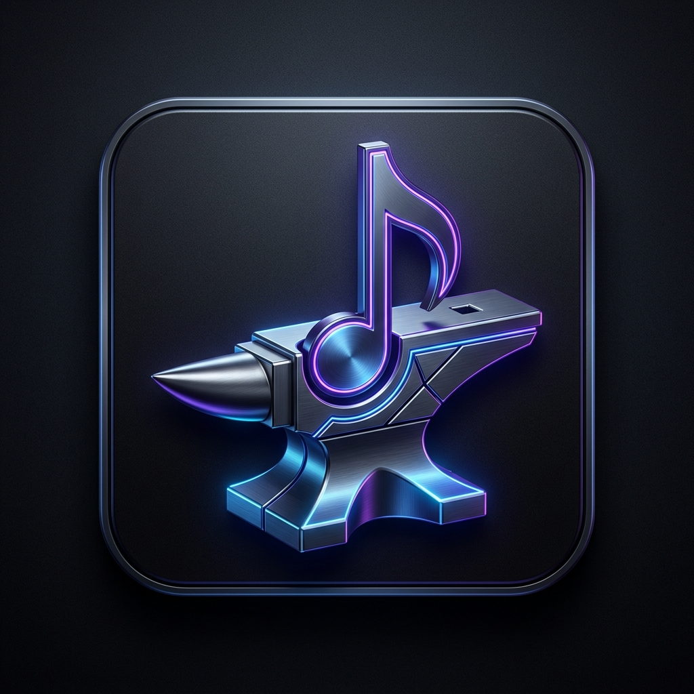

# ForgeBGM - AI Music Generation Assistant

## 🎼 概要 / Overview
**ForgeBGM** は、AI音楽生成エンジン（Suno, Udio, Stable Audio等）向けの高品質なプロンプトを構築するための専門アシスタントツールです。独自のSKILLシステムと最適化プロンプト構造（v2.0）により、ユーザーの意図を正確に反映した音楽構成案を瞬時に生成します。

**ForgeBGM** is a specialized assistant tool designed to construct high-quality prompts for AI music generation engines. With its unique SKILL system and optimized prompt structure (v2.0), it instantly generates music composition plans that accurately reflect user intent.

## ✨ 特徴 / Features
*   **⚡ HyperSpeed Engine**: C# / .NET ネイティブによる爆速レスポンス。 / Ultra-fast response with native C# / .NET.
*   **🧠 Intelligent SKILL System**: 8つの専門スキルからAIが最適なものを自動選択。 / AI automatically selects the best skills from 8 specialized categories.
*   **📝 v2.0 Prompt Structure**: 音楽理論に基づいた8つの必須項目を網羅した構造化プロンプト。 / Structured prompts covering 8 essential items based on music theory.
*   **🕒 History Log**: 過去の生成履歴を保存し、いつでも再呼び出し可能。 / Save generation history for instant recall.
*   **🌐 Multi-language Support**: 日本語と英語のUI切り替えに対応。 / Supports UI switching between Japanese and English.
*   **🎨 Premium UI**: ダークモードとグラスモルフィズムを採用した高級感のあるデザイン。 / High-end design with Dark Mode and Glassmorphism.

## 🚀 使い方 / How to Use
1.  `ForgeBGM.exe` を起動します。
2.  曲のイメージを入力するか、プリセットボタンを選択します。
3.  `Generate` を押し、最適化されたプロンプトとレポートを取得します。
4.  コピーボタンでプロンプトをコピーし、お好みのAI音楽生成サービスへ貼り付けてください。

1. Launch `ForgeBGM.exe`.
2. Enter your musical idea or select a preset button.
3. Press `Generate` to get the optimized prompt and report.
4. Copy the prompt and paste it into your favorite AI music service.

## 🛠 開発環境 / Tech Stack
*   **Framework**: .NET 10.0 / WPF
*   **Language**: C# 12
*   **Architecture**: Standalone Native App (No Python/Browser dependency)

## 📄 ドキュメント / Documentation
*   [SPECIFICATION.md](SPECIFICATION.md) - 技術仕様 / Technical Specification
*   [MANUAL.md](MANUAL.md) - 取扱説明書 / Instruction Manual
*   [CREDITS.md](CREDITS.md) - 外部サービス・ライセンス情報 / Credits & License

---
© 2026 ForgeBGM Project. Built for professional music creators.
